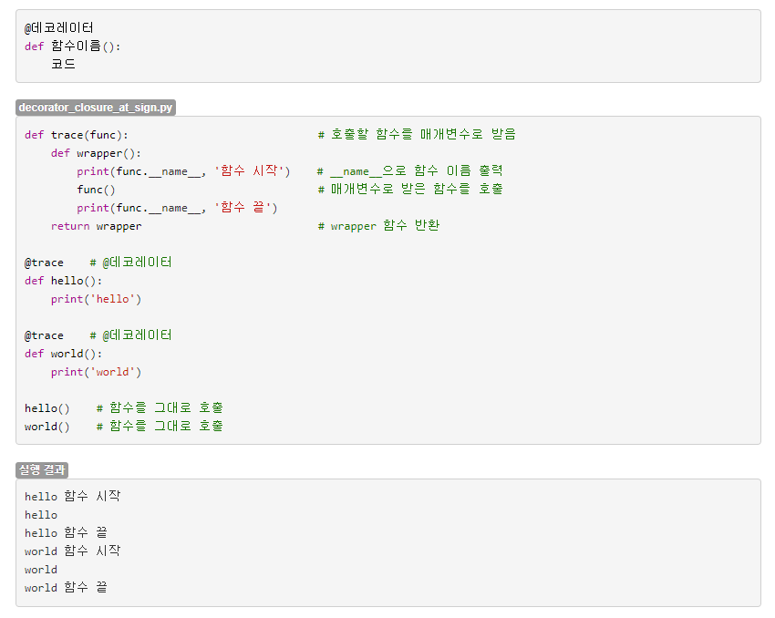

# Flask 를 위한 꼭 알아야 할 파이썬 문법

**핵심 타입 시스템:**

    int, float, str 등.. 의 타입들이 존재함.

    (int 는 32바이트 2147483647 까지 이런식 아님! 무한범위.)

    (double 은 없고 float이 모든 범위 커버)

    (String 이라고 안하고 str 이 정식 키워드)

    하지만 변수 정의할때, num = 50 이런식으로 타입을 명시할수 없고 인터프리터에 의해 동적으로 결정됨. (파이썬의 핵심. 모든 파이썬의 장점과 단점들은 이 부분때문에 시작 됨.)

    boolean type(참, 거짓) 은 True, False 이다. (앞글자 대문자임에 주의. C++ 은 true, false)  

**명시적 타입 캐스팅 (강제 형변환)**

    print( int(3.5) )    → 3

    int(형변환할것)

    float(형변환할것)

    str(형변환할것)

    이런식으로 사용가능.

**기본 연산자 시스템**

    +, -, *   → C, 자바 와 동일

    / 는 실수나눗셈(애초에 변수 타입이 동적으로 변하기 때문에 7 / 3 = 2.333.. 됨

    // 는 몫 나눗셈 → 7 / 3 = 2

    % 는 나머지 구하기 (modular)

    String 을 + 로 합칠 수 있다. → “hello” + “python” = “hello python”
    
    단, “hello “ + 3 같은 String + number 는 문법에러임! → 자바스크립트에서 이와 같은 문장에서 number를 묵시적 형변환으로 “3” 으로 캐스팅해서 “hello 3” 이 되는 방식은 수 없이 많은 찾기 어려운 버그를 유발함. → 파이썬은 그렇게는 안 하겠다는 설계(??)

**주석은 # 이다.** 

    → 거의 모든언어에서 // 인데 왜 파이썬만? → // 를 몫 나눗셈연산자로 채택했기 때문에 중복되어서 어쩔 수 없음. 

**명령어 끝에 세미콜론 사용할수없음**

    print(”hello python”);      → 하면 문법 에러임.

**조건문**

    if num > 50 and num < 100 :

    print(”50보다 크고 100보다 작다.”)

    C, 자바 에서 논리연산자와 비교

    && → and

    || → or

    … 이런식

    if (num > 50) and (num < 100): 이런식으로 괄호로 식을 명시적으로 묶어주는게 당연히 좋음!

**반복문**

    0부터 4까지 출력. 

    아래의 range()함수는 0~N-1 까지의 연속된 숫자 리스트를 생성해줌. 파이썬의 반복문은 데이터집합(리스트 등)에서 순차적으로 하나씩 꺼내서 작동.

    for i in range(5):

    print(i)

    즉, 이렇게사용가능

    myList = [3,5,7,9]

    for i in myList:

    print(i)

**함수**

    def functionName(parameter1, paramter2, parameter3):

    otherFunction()

    num = 3

    a = num + 5

    …

    …

    return 100

    리턴타입 명시하지않음 → 왜? → 동적 타입 언어이기 때문에 필요 없다.

    꼭 알필요는 없는것들:

    둘 이상의 값을 리턴할수도있다. return a, b, c

    → 내부적으로는 자바의 객체나 C의 포인터같은 식으로 전달할것으로 추측중

    가변개수인자를 받는문법도 존재함.

    함수를 호출하기 이전에 (코드상으로 윗부분에) 함수가 선언되어있어야함.(C 방식으로 생각하면 당연)

    → 자바스크립트는 function hoisting 이라는 기능을  제공해서 위를 지키지않아도 가능

**Indentation(들여쓰기)으로 코드 블록 구분하는 것 이해.**

    if num == 30:

    print(num)

    위는 문법 에러. 실행 불가.

    이유: 파이썬은 블록(조건문블록, 반복문블록, 함수블록, 클래스블록 등..)에서 중괄호 {} 를 사용하지 않는 대신 들여쓰기로 구분한다.

**리스트**

    파이썬 공식 데이터 집합 자료구조.

    C/C++ 배열, vector 등의 목적에 해당.

    emptyList = list()      # 이 방식 권장함.

    emptyList2 = []         # 동작은 같음. 취향에 따라 선택.

    nums = [1,2,3,4]        # 매우 유연함. C언어로하면? int nums[4] = {1, 2, 3, 4};

                                      # C++ STL로하면? vector<int> nums = {1, 2, 3, 4};

    맨뒤에 5 추가할때 nums.append(5) → add 가 아니라 append 임! (실수하면 버그찾는데 몇시간)

    [1,2,3,4,5]

    이 외 구글검색해서 사용하면 됨.

    리스트이다. 즉, things = [1, 2, “hello”, 3.5] 이런것도 가능하다. → 쓸 일이 없을듯?

### **딕셔너리 (중요)**

    사전?

    키-값 데이터 집합 자료구조.

    C++ 에서 unordered_map, map 등의 STL로 제공됨.

    자바는 hash map ? map? 그런거

    datas = { “name” : “Peter”, 3 : “hello”, “myList” : [1,2,3,4] }  등 유연함.

    { 키 : 값, 키 : 값 .. } 지키면 됨.

    datas[”name”] 이라고하면 “Peter” 가 됨.

    datas.get("name") 이런식으로 쓸수도있는듯 최근버전 문법..(?) . 선택은 취향대로.

**f-String (Formatted String)**

    num = 10

    print(f’number is {num}’)

    출력: number is 10

    이런식으로 이용 가능한 포맷 스트링.  SQL 쿼리를 날것으로 작성하려면 반드시 알아야 함.

**import 문** 

  C언어의 #include <stdio.h> 처럼 다른파일을 참조시키는것.

  (모듈 및 다른파일 추가 할때 [otherFile.py](http://otherFile.py) 라면 import otherFile 이 됨.(파일이름이 모듈이름), 그리고 프레임워크 내장모듈이름과의 충돌을 방지하기 위해 from . import otherFile 같은 방식으로 경로를 명시해주는것이 좋은듯. (from . → 현재경로)  

**클래스**  
자바와 매우 흡사함.

    class 클래스이름(상속받을클래스):
      def __init__(self, param1, param2 .. ): # __init__이라고 정해진 이름의 생성자.  
        self.name = param1 # 인스턴스가 생성되면 가지게되는 변수.
      def func1(self): # self 는 함수호출시 호출한 인스턴스임. 즉, 인스턴스없이 호출불가능한 함수.
        ...

      def func2(): # 이렇게하면 인스턴스 생성없이 호출가능. 즉 자바의 정적(static) 메소드임.
        ...  

      

계속 추가..

  ---

### (필수X) **공부하는 비용에 비해 가성비가 떨어지는 고급/현대 문법**

**파이썬은 일급객체를 지원한다. (자바는 지원 안한다)**

    def func(a, b):

    return a+b

    add = func               → 변수에 함수를 대입할 수 있다는 것.

    add(3,5)                    → 8

    → 이로인해 파생되는 기능들 : 콜백 함수, 클로져 .. (간략히 설명할 수 있을정도의 이해수준이 안되어서 생략함)

**데코레이터**

  ~~솔직히 아이고 어렵다.~~

  대충 함수 간 의존관계를 명확히 나타내주고 코드 중복을 줄여서 보기 편하고 확장성이 좋고 …. 등의 소프트웨어공학적인 목적을 위한 문법.

  스프링 계열의 AOP 에 대응되는 기능인 것으로 알고 있음.