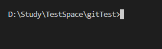
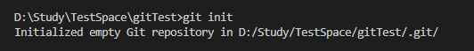
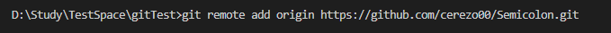

# Github 간단 사용법 예시

0. Git 설치 및 환경변수 등록

    생략

1. 작업폴더 생성
    
    임의로 gitTest 라는 폴더를 만들었음.
    

    

2. 프로젝트를 초기화 하는  세 가지 방법. (택일)
  
    2-1. git clone [https://github.com/cerezo00/Semicolon.git](https://github.com/cerezo00/Semicolon.git)

    == git init + git remote add origin 주소 + git pull(== git fetch + git merge)

    이 방법은 프로젝트 폴더 Semicolon 을 생성 하게 됨. (이후 이 내부에서 git 명령을 진행해야함)
  
    2-2. 위 과정을 세분화 한것.

    git init

    

    현재 폴더 git 으로 관리시작 및 버전추적을 초기화 하는것

    git remote add origin [https://github.com/cerezo00/Semicolon.git](https://github.com/cerezo00/Semicolon.git)

    

    원격저장소 연결

    git pull

    (사진생략)

    원격 저장소에 있는 파일들 모두 가져오기

    파일이 안가져와지면 git pull origin master 라고 원격저장소와 로컬저장소 브랜치 이름을 명시해줘야하는듯.
  
    2-3. VScode 에서 GUI로 하기.

    (미완성)
  
3. 파일 추가 또는 수정 등 해야할 작업 진행 후,
  
4.  git add .

    추가된 파일 전부다 추가
  
5. git commit -m “message”
    
    새 버전 등록
    

---
  
### **PUSH(원격저장소에 업로드), PULL(원격저장소에서 가져와서 병합) 다시 정리**

  git push origin 로컬브랜치:원격브랜치

  git pull origin 원격브랜치:로컬브랜치

  즉,

  git pull origin backend:my_branch_name

  으로 작업을 시작하고,

  git push origin my_branch_name:backend

  로 작업을 마무리 하면 됨.
  
## **master, frontend 브랜치는 건드리지 않기로 약속.**

  이외 명령어

  git branch

  존재하는 브랜치 확인

  git branch -m old_name new_name

  브랜치 이름 변경

  git branch add <branch_name>

  브랜치 추가

  ~~git checkout <branch_name>~~

  해당 브랜치로 이동

  새 버전부터는 —> git switch <branch_name>

  으로 사용하라고 권장되는 듯.