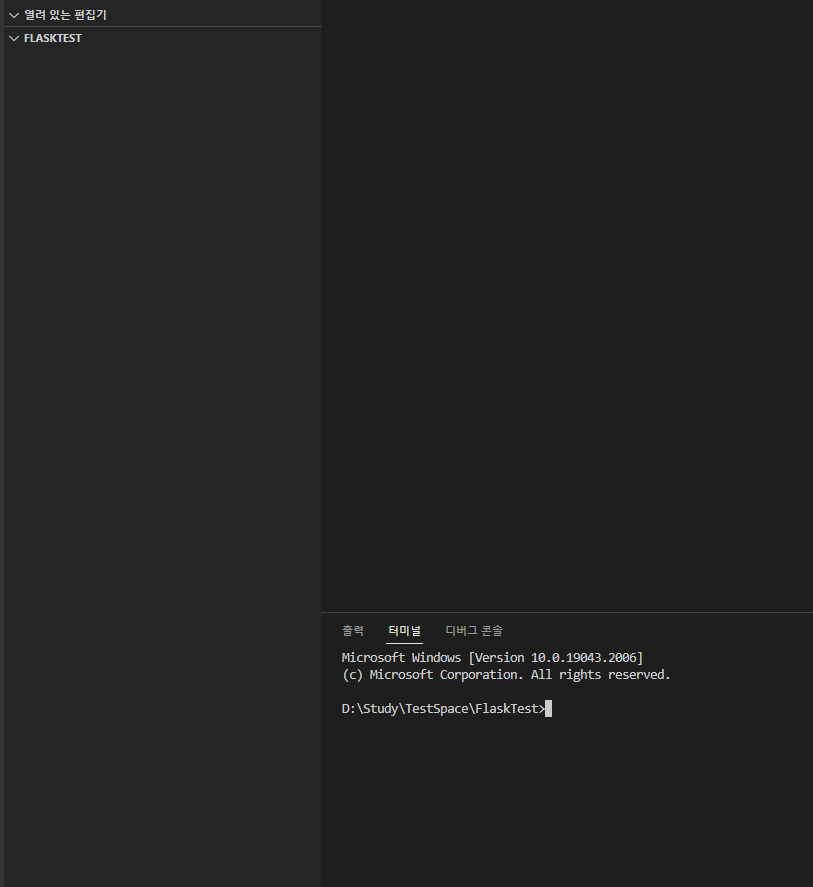
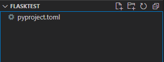
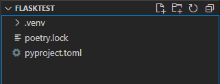
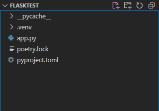
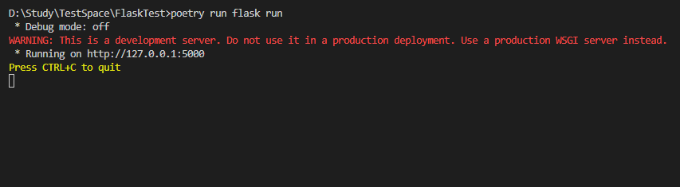

# 가장 빠르게 Flask 프로젝트 만들어보기

1. 작업할 폴더 생성, vscode 상의 터미널에서 해당 폴더로 진입.

    폴더명을 임의로 FlaskTest 로 하였음.

    
<br /><br />
2. 터미널에 poetry init 을 입력하고 모두다 엔터로 넘김.

    

    pyproject.toml 파일이 만들어진다.

    ( html, yaml 등 과 같이 형식이 약속된 Markup Language 파일로, 프로젝트에 추가되는 다양한 라이브러리, 패키지, 모듈 등과 설정요소들을 관리해주는 파일 )

    → 이 작은 파일 하나만 건네주면 poetry가 설치된 다른 컴퓨터에서 내가 설치해둔 똑같은 모듈들을 설치하도록 자동화할 수 있음.
<br /><br />
3. 터미널에 poetry add flask 입력.

    현재 프로젝트에 flask 프레임워크를 설치하겠다는 의미.

    
<br /><br />
4. app.py 파일을 생성하고 다음과 같이 작성하고 저장

    ```python
    from flask import Flask, render_template

    #Flask 객체 인스턴스 생성
    app = Flask(__name__)

    # 라우팅 예제
    '''
    이 부분은 여러줄 주석임.

    라우팅 예제
    @app.route('클라이언트에게 요청을 받을 URL경로')
    def 적절한함수이름():
      함수 내에서 다양한 처리
      ....
      ....

      return 응답할 데이터를 리턴(html파일, image파일, 단순문자열, json데이터 ...)

    '''

    @app.route('/')
    def index():
      return "<h1>Hello Flask</h1>"

    @app.route('/abcd')
    def abcdefg(): # 적절하지 못한 함수이름. 즉, 임의로 설정가능.
      return "<h1>Hello Python</h1>"
    ```

2. 터미널에서 ~~poetry run flask run 실행~~ 이 방식으로 실행하지 말것.(221006 12:21 수정)

    폴더 구조:

    

    터미널 실행화면:

    

    웹 브라우저를 열어서 127.0.0.1:5000 으로 접속(==서버에 요청전송)하면,

    우리가 설정한 루트URL에 대한 응답처리인 <h1>Hello Flask</h1>를 받은것을 확인할수있음.

    

    마찬가지로 127.0.0.1:5000/abcd 에 대해서도 동일.

    터미널에서 Ctrl + C를 입력하면 서버가 종료 됨.
<br /><br /><br /><br />
  전체 코드 Github에 업로드함. 221005 00:04