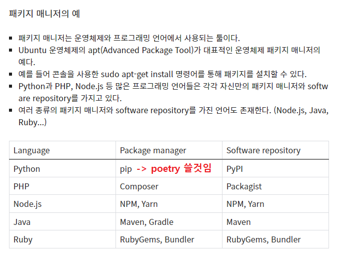

# 초간단 백엔드 개발환경 세팅

0.  Visual Studio Code 설치 및 파이썬 관련 확장 설치

      [https://code.visualstudio.com/](https://code.visualstudio.com/)
  

1. python 설치 (최신버전 권장, 최소 3.7 이상)

      [https://www.python.org/](https://www.python.org/)

      설치 후 환경변수에 등록.

      (또는 설치 도중 ADD PATH 같은 체크박스 반드시 클릭: default값이 클릭된 상태일 것임.)
  
2. (필수는 아님) poetry 설치 (패키지 매니저 + 가상환경을 편하게 관리)

      윈도우 파워셸에 아래의 명령어를 입력

      (Invoke-WebRequest -Uri [https://install.python-poetry.org](https://install.python-poetry.org/) -UseBasicParsing).Content | py -
        
      설치 후 환경변수에 poetry.exe 또는 바로가기파일의 경로를 등록.

      문제가 발생할 경우, 아래 링크 참조.

      [https://python-poetry.org/docs/#installing-with-the-official-installer](https://python-poetry.org/docs/#installing-with-the-official-installer)

      왜 pip 가 아닌 poetry 를 쓰는가? → pip + 가상환경관리 지원

      
  
개발환경 세팅 완료.

---