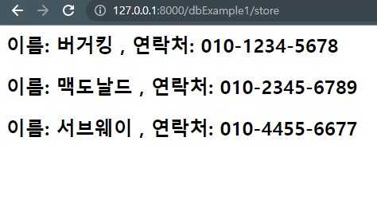

# Database Control

## **MySQL Connection , Raw SQL Query 그리고 ORM**

이 문서에서는 가장 원시적인 라이브러리들만을 이용하여 순수한 SQL쿼리를 문자열로 작성하여 DB에 넘겨주고, 데이터를 받아오는 방법을 실습해보고,  
그 다음에는 ORM (Object Relational Mapping) 라이브러리를 이용하여 실제 업무에서 사용되는 방식을 실습해 볼 것이다.  
DAO(Data Access Object), DTO(Data Transfer Object) 등을 이용한 객체지향 기법을 이용하여 데이터베이스 입출력을 효율적으로 관리하는 방법을 실습해 볼 것이다.  
추가로 ORM 사용의 필요성을 직접 체감해보고, 장단점을 이해할 수 있는 수준까지 공부할 수 있으면 좋을 것 같다.
   
파이썬(또는 어떤 다른 프로그래밍 언어)으로 작성된 프로그램에서 DBMS 와 통신하기 위해서는 복잡한 절차가 필요하다고 함.  
이를 간편하게 지원해주는 라이브러리가 대부분의 상용 프로그래밍 언어 차원에서 제공된다. (JDBC 등..)  
파이썬에서는 mysqlclient, mysql-connector-python , pymysql 정도가 있는 듯.  
이 정도조차 사용하지 않는 원시적인 방법을 사용한다는 웹 응용 프로그래머 이야기는 본 적도 없고, 들어본 적도 없고, 읽어본 적도 없다.  
각자의 장단점, 차이점 등을 열심히 검색해보면서 공부해보면 좋겠지만, 대충 훑어보고 pymysql 을 사용하기로 결정했다.(더 좋은게 있으면 제안 바람)  
   
## **0. MySQL 설치 및 서버 구동**
(생략)

## **1. TCP 방식 MySQL 연결 설정 및 .gitignore**
app.py 와 같은 경로에 config.py 파일을 만들어준다.  
여기에 DB 의 정보를 딕셔너리로 작성해줄것임.  
<pre>
  <code>
    DBINFO = {  
      'user'     : 'root(연결할계정이름)',  
      'password' : 'mysql의 비밀번호',  
      'host'     : '49.50.165.150(mysql이 구동중인   호스트 ip주소)',  
      'port'     : '3306(작동중인 포트)',  
      'database' : 'semicolondb  (접근할데이터베이스==스키마 이름)'  
    }
  </code>
</pre>
이렇게 작성했음.  

이 정보들(특히 비밀번호)은 github에 한번 올라가는 순간 끝난다고 함. 삭제하거나, 이전버전으로 되돌리거나, 심지어 history를 지워도 어떻게든 접근할 수 있다고 함.  
따라서 .gitignore (github에 올라가지않도록 관리) 해줘야함.  

config.py 와 같은 경로에 .gitignore 라는 파일을 만든다(확장자없음)  
그리고 그냥 config.py 라고 쓰고 저장해주면 끝이다.  
이 작업은 git add . (스테이징) 이전에 반드시 수행되어야 함.  
## **서비스 전체가 무너져 내릴 수 있는 중요한 부분이므로 이부분 각별히 주의 !**  
   

## **2. pymysql 을 이용한 DB 연결**  
pymysql 은 외장 모듈이므로 설치해주어야 한다.  
poetry add pymysql 로 간단하게 가상환경에 추가한다.  
또는 pyproject.toml 파일에 이미 팀원이 추가해뒀는지 확인해본다.  
   
blueprints 폴더에 dbExample1.py 를 추가한다.  
app.py 에 라우터 등록.  
코드와 주석 Github 예제 참고.  
실행 결과. 221008 기준 store 테이블에 레코드 3개를 불러왔다.
  
   

---  
**여기서 부터 FlaskTest2 프로젝트 코드를 이용하여 진행 됨.**  

## **3. Flask 의 ORM, SQLAlchemy**  
Object Relational Mapping 이란, 객체를 이용한 DB Control 기술이다.  
절차지향적 코드인 SQL을 객체지향적인 패러다임으로 접근하기 때문에, 코드의 가독성, 유지보수성, 확장성, 재사용성 ... 등이 뛰어난 소프트웨어 공학적인 목적을 위한 기술이라고 볼 수 있을 것 같다.  
단점도 있다고 함. 복잡한 쿼리를 다루기 어렵고, Learning Curve 가 높으며, 신중한 설계와 이해가 기반이 되지 않으면 의도치 않은 문제들을 발생시킬 여지가 있다고 함.  
개인적으로는 Learning Curve 가 높다 + 소프트웨어 공학적인 목적을 위한 기술 이라는 점에서 소규모 프로젝트 일수록 가성비가 떨어지는 기술이라고 생각한다.  
추가적으로 어느정도 SQL Injection 에 대한 보안을 위한 기술들도 지원한다는 듯.  
   
SQLAlchemy 는 파이썬 진영의 ORM 라이브러리 이다.  
그리고 이것을 Flask 친화적으로 지원해주는 라이브러리가 flask-sqlalchemy 인데, 이것을 공부해 볼 것이다.  
https://flask-sqlalchemy.palletsprojects.com/en/3.0.x/ 공식문서  
만약 Flask 로 순수 SQLAlchemy 라이브러리만을 연동해서 사용하는 레벨을 공부하고자 한다면 https://flask-docs-kr.readthedocs.io/ko/latest/patterns/sqlalchemy.html 를 참조.  
poetry add flask-sqlalchemy==2.5.1  로 모듈 설치.(버전 호환성때문에 restx 와 함께 쓰려면 최신버전을 사용할 수 없겠다.)  
 
대략적으로 SQLAlchemy 가 제공하는 DB Control 에는 3가지 방식을 사용할 수 있는 듯 함.  
https://stackoverflow.com/questions/34322471/sqlalchemy-engine-connection-and-session-difference  
자세한 것은 위 링크 참조.  
크게 engine, connection, session 이렇게 3가지 방식이 있는 것 같은데,  
engine : 가장 원시적인 SQL 쿼리를 직접 작성하는 방식. 아무래도 pymysql 을 이용한 방식과 딱히 다를 바는 없어보임. pymysql 의 sqlalchemy 버전 정도로 생각하면 될 듯 ?  
connection : 조금 더 추상화된, 트랜잭션의 commit 시기를 결정할 정도의 자유도를 가진 방식.  
session : 가장 고수준으로 추상화된 ORM 방식.  
즉, 추후 원시 SQL 쿼리를 사용하고 싶으면 pymysql 대신 engine 방식을 쓰고, 조금 더 편리하지만 ORM 정도로 제한요소가 많은 것이 싫다면 connection 방식, 가장 객체지향적이고 생산성이 높은 방법을 사용하고 싶다면 session 방식을 사용하면 될 듯.  
위 내용에는 오개념이 다수 포함되어 있을 수 있음. session을 사용하는 방식 또한 구버전 방식, 최신버전 권장 방식 등 다양한 것 같은데 쉽게 파악하기 어려운 듯. 잘 알아보기 바람.  
그렇다면 바로 session 방식을 사용해보자.  
...  
두서 없이 삽질 기록  
create_all() 함수는 ORM 파이썬 코드를 실행시켜 DB에 스키마를 CREATE 하는 기능이다. 공식문서에 manually 하게 한번만 실행하라고 나와있음. 우리는 필요 없으니 해당 사항이 필요한 경우 아니면 사용하지말것. + 이미 데이터베이스 상에 스키마가 존재하는 경우, ORM 모델을 변경한다고 해서 create_all()이 실제 DB의 스키마를 바꿔주진 않는다고 함.  
DB 객체를 어디서 생성하고 어떻게 호출하여 사용해야 하는가 ?  
https://stackoverflow.com/questions/9692962/flask-sqlalchemy-import-context-issue/9695045#9695045  
웹 상에 나와있는 SQLAlchemy 관련 자료와 예제들을 보며 그대로 따라하는 것은 사실상 매우 어렵다. 순환 import 와 파이썬 객체의 라이프사이클에 대한 꽤 깊은 이해가 필요하다고 생각함. 웹 상의 대부분 예제들은 그냥 작동하니까 쓰는 듯 함.  
다음은 SQLAlchemy 객체타입, MySQL 타입, Python 타입 매칭. (TIMESTAMP를 잘 봐둘 것. Python이나 JS는 의도치 않은 묵시적 형변환이 발생해버리면 절대 못 찾음.)  
  
대충 SQLAlchemy 쿼리문 정리.  
(추후 추가)  
 
쿼리를 통해 받아온 Object 를 Dict(==Json) 타입으로 변환하는 가장 깔끔하고 객체지향적이고 성능상으로 좋은 방법을 찾아야 함.  (Json 직렬화)  
https://github.com/sqlalchemy/sqlalchemy 시간 여유가 된다면 SQLAlchemy 의 창시자 zzzeek github 를 뒤져서 최신 권장 방법을 찾아내는것이 좋을수도 있겠음.  
https://stackoverflow.com/questions/1958219/how-to-convert-sqlalchemy-row-object-to-a-python-dict 여기도 참조.  
   

## **4. DAO와 DTO를 활용한 객체지향 테크닉**  
자프링 진영과 구조적이고 개념적인 차이점들이 발생하는 부분.  
시간을 두고 다양한 상황들을 겪어보며 경험적으로 감을 잡아가야 할 듯.
   

