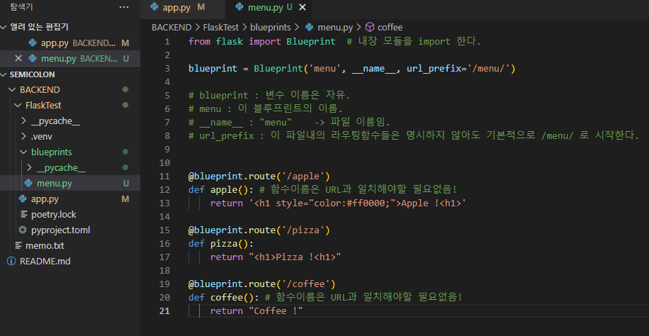
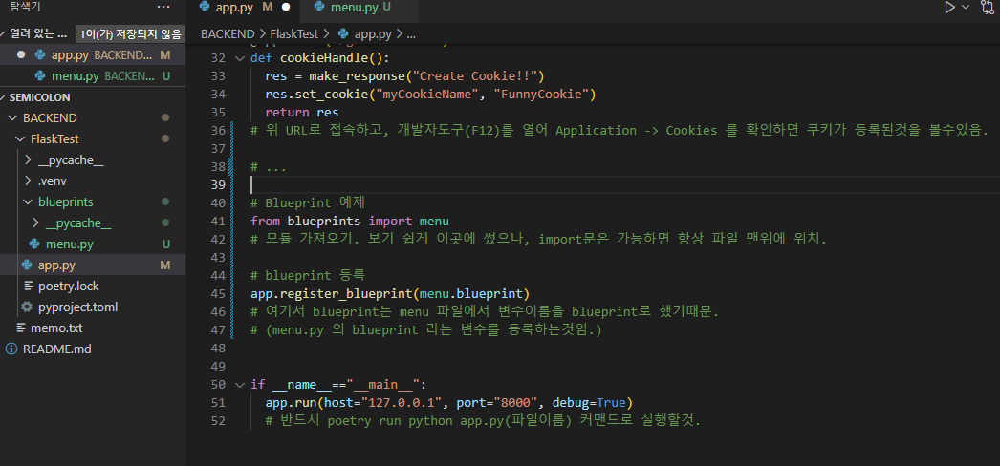
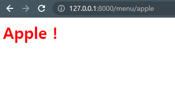

# 대규모 라우팅을 관리하는 Blueprints

청사진. 설계도.

→ 전혀 기능에 대해 직관적이지 않은 이름을 사용했다고 생각함. 왠 청사진?

**내장/외장 :**    Flask 내장 모듈 (별도의 설치 필요 X)  
   

**가정된 문제 상황:**  
/api/account , /api/something , /api/payment , /api/menu …

서로 다른 기능을 처리하는 라우트 함수들이 한 파일 내에 모두 일렬로 모여있어서 관리가 어렵다.
   
**문제 해결을 위해 제공되는 기능:**

한 기능(예, 인증)을 처리하는 라우트 함수들을 한 파일에 묶어두고, 여러 개의 파일로 분할하자.
   
**어떻게 쓰나?**

브라우저에 접속하여 /menu/apple , /menu/pizza , /menu/coffee 등의 URL에 접속하면 결과를 확인 가능.

코드 전문 github backend 브랜치에 업로드. 221007 . 01:37  

   
Flask Restx 라이브러리를 이용하면 Blueprint 방식에서 Namespace 방식으로 사용법과 객체, 함수 이름들이 조금씩 달라지며 코드가 좀 더 관리하기 수월하고 깔끔해짐.  

처음부터 그 부분으로 공부해도 괜찮을 듯.