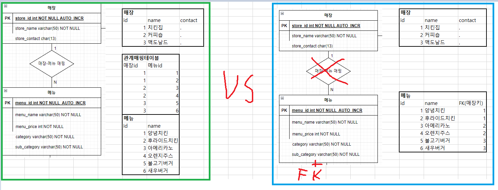

# MySQL을 기준으로 하는 데이터베이스 시스템 공부 기록  

두서 없이 나열.  

**MySQL 공식 문서 상 테이블 이름은 복수형을 쓰지않고 단수형을 쓴다.**  
https://medium.com/@fbnlsr/the-table-naming-dilemma-singular-vs-plural-dc260d90aaff  
관련된 글.  

**Key Field. {table}_id vs id**  
정해진 건 없는 듯 해서 나는 id 로 선택.  
참고 https://sabarada.tistory.com/49  

**MySQL 의 한글 Byte**  
환경에 따라 다를 수 있으니 SELECT LENGTH("한글"); 쿼리를 이용하여 확인할 것. 일단 나는 3바이트. -> varchar(12) 로 해야 한글 3글자까지 등록가능.  

## Foreign Key VS 관계매핑테이블  
대략 다음과 같은 상황이다.  
  

https://engineering-skcc.github.io/oracle%20tuning/foreign_key_%EC%97%86%EC%9D%B4_%EA%B5%AC%EC%B6%95%ED%95%98%EB%8A%94_DB/  
https://www.dogdrip.net/406595980  
https://www.phpschool.com/gnuboard4/bbs/board.php?bo_table=forum&wr_id=126900  
https://devbab.tistory.com/14  
https://velog.io/@subutai/%EB%A7%A4%EC%9D%BC-2day  
https://okky.kr/articles/497991  
https://okky.kr/articles/913372?note=2304686  
논란이 없는 글이 없음.  
대충 맥락을 정리하자면,  
DB의 관점에서, 그리고 이론상으로도 FK는 관계형 데이터베이스시스템의 강력한 기능이고 규모가 엄청 거대해졌을때 FK가 없으면 관리가 불가능할정도라는 말도있고, 이쪽 입장들은 FK를 쓰지 않는 시스템은 애초에 세심한 설계 없이 빅뱅 식으로 중구난방으로 만들어둔 조악한 시스템 취급, 경험 상 FK를 쓰지 않는 회사를 거의 본적 없다는 식으로 말함.  
반대의 입장들은, FK를 써두면 일단 성능 상 좋지 않고, 추후 데이터구조를 변경해야할 때 관리에 큰 비용이 들어가기 때문에 확장과 유지보수에 어려움이 많고, 마이그레이션(?) 에도 어려움을 겪는다고 함, 이쪽은 FK를 쓰는 회사를 거의 본적 없다고 함.  
황부현 교수님의 예제들에는 FK가 쓰이지 않음.(왜?)

## MySQL에서 많이 쓰는 스토리지 엔진 종류와 특징  
**InnoDB 엔진**  
제일 많이 쓰는 사실 상 표준이 아닌가 ?  
롤백이 많이 발생하지 않고, 짧고 많은 트랜잭션을 처리하는데 유리.  
PK 는 작은 값을 가지게 하라.   
Lock 없이 MVCC(Multi Version Concurrency Control) 라는 기술을 사용하여
일관된 읽기를 처리한다고 함.  
외래 키는 여러가지 제약으로 실무에서 잘 사용하지 않는다는 글이 있는데(이부분 위에서 다시 정리해둠), 아무튼 InnoDB는 지원하기 때문에 개발환경에서 유용하다고 함.  
오라클 아키텍쳐와 유사한 부분이 많다고 함.  

**MyISAM 엔진**  
Transaction 을 지원하지 않아서 간단하고 빠르지만, 동시성 제어가 어렵다.  
어떤 Lock 시스템 덕분에, SELECT와 동시에 테이블생성이 가능하고 유용하게 쓰일 여지가 있다고 함(동시삽입 이라고 부른다고 함)  
서버가 오프라인일때도 테이블을 조사하고 복구할 수 있다.  
...  

**Memory 엔진**  
메모리에 데이터를 저장(Redis 와 차이 ?) 하기 때문에 속도가 매우빠르고, 데이터를 잃어버릴 위험이 있음. 따라서 중요도가 낮고 빠른 처리가 필요한 임시테이블로 많이 사용된다고 함. 메모리 테이블(HEAP테이블이라 불렸다?) 의 데이터는 서버 재시작 시 날아가지만, 구조는 유지된다고 함.
Transaction 없고, Table-Level-locking  
--> 전체적으로 Redis 와의 차이를 알아보면 좋겠다.  
CREATE TEMPORARY TABLE 로 만들어진 임시 테이블은 단일 연결시 종료될 시 사라지는 것이고, 어떤 엔진이든 사용할 수 있는 것. 메모리 테이블과 착각하기 쉽다고 함.

**Archive 엔진**  
매우 빠른 INSERT  
...  
계속 .. 아래는 참조한 글  
https://nomadlee.com/mysql-%EC%8A%A4%ED%86%A0%EB%A6%AC%EC%A7%80-%EC%97%94%EC%A7%84-%EC%A2%85%EB%A5%98-%EB%B0%8F-%ED%8A%B9%EC%A7%95/

**CSV 엔진**  

**Federated 엔진**  

